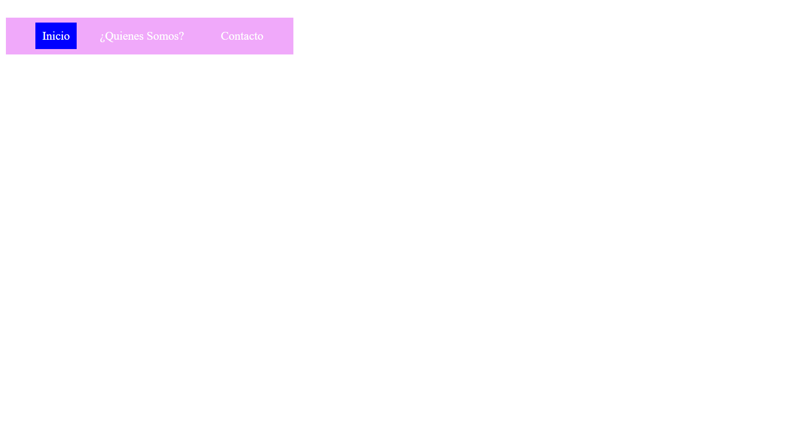

<h1>Taller 9: Jhoan Jimenez</h1>

<h2>Informacion</h2>

Curso: Full Stack Basico - Grupo 1

Profesor: Cristian Patiño

<h2>Punto 1: Link de Figma<h2>
<a href="https://www.figma.com/file/2MfamJ2cBGJXNXuMhgTiZg/JHOAN-JIMENEZ---FIGMA-EXCERCISE?type=design&node-id=7%3A682&t=neabIeoAr19jowkV-1">Link de Figma</a>

<h2>Punto 2 HTML</h2>

<h2>Punto 3 CSS</h2>

<h2>Punto 4 HTML Y CSS</h2>

<h2>Punto 5 HTML Y CSS</h2>

<h2>Punto 6 HTML Y CSS</h2>

<h2>Punto 7-8 HTML Y CSS</h2>

<h2>Punto 9 HTML Y CSS</h2>

<h2>Punto: Link de Pagina Web<h2>
<a href="https://sebaas08.github.io/Taller-9-full-stack/">Link Pagina</a>